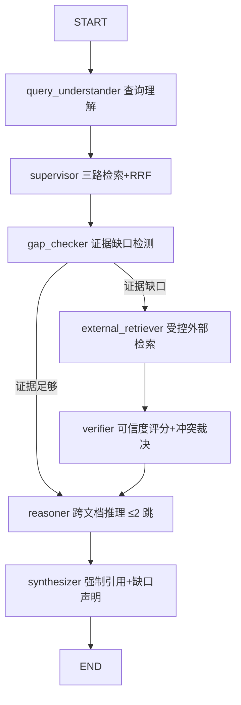

# Day25 两阶段实现报告：证据缺口检测（阶段 1）+ 受控外部检索（阶段 2）

> 范围：L4 问答层（`:mod:`aisec_intel.qa``）、安全清洗（`:mod:`aisec_intel.security``）、
> 存储（迁移 `0009` + `external_evidence` 隔离表）。
> 冻结契约（§10）：`UnifiedVuln` / `RawItem` / `EnrichedVuln` **零变更**；
> `CitationSource` 新增枚举值 `"external"`（只增不改）；`QAState` 新增 3 个内部状态键。

## 1. 状态图变化（核心）

```text
Day24：START → query_understander → supervisor ─┬─(有证据)→ reasoner → synthesizer → END
                                               └─(无证据)→ synthesizer → END

Day25：START → query_understander → supervisor → gap_checker ─┬─(证据足够)→ reasoner → synthesizer → END
                                                              └─(证据缺口)→ external_retriever → verifier → reasoner
```

`graph_mermaid()` 实测输出：



节点顺序（`/qa/health` 的 `plan` 字段）：`query_understander → supervisor → gap_checker →
external_retriever → verifier → reasoner → synthesizer`（`external_retriever` / `verifier` 仅在缺口分支执行）。

## 2. 阶段 1：证据缺口检测（P0）

| 项 | 内容 |
|---|---|
| 新文件 | `src/aisec_intel/qa/evidence_gap.py`（纯函数 + `GapChecker` 节点）；`GapReport` 定义在 `qa/state.py`（LangGraph 需要在运行期解析状态类型） |
| 规则 | 修复/升级 → `fixed_version` + `vendor_advisory`；影响资产 → `affected_components` + `affected_versions`；攻击链 → `attack_techniques`；是否在野 → `kev` + `epss`（意图与关键词**取并集**） |
| 事实抽取 | 三通道：① 元数据键（`cpe_matches` / `ecosystem_packages` / `fixed_versions` / `kev` …）② 文本标记（与 `index_text` / `render_structured_summary` 渲染口径一致：`修复版本:` / `受影响版本:` / `攻击技术` / `官方补丁/公告` …）③ 结构化 token（`vendor:product`、`T1190`，先剔 URL 防误判） |
| 判定口径 | `missing = required − present`；`has_enough = not missing`。无强制事实时：有证据即足够；无证据但含 CVE/组件实体 → 交由外部检索；两者皆无 → 放行（由 Synthesizer 回「未找到相关信息」，**不发起外部调用**） |
| 关键修复 | **融合遮蔽**：RRF 对同一 CVE 只保留一份代表载荷（较长者优先），多跳路径文本会遮蔽图谱摘要里的「受影响版本」→ 缺口检测改为看 **`fused` + 各路未融合原始结果** 的并集（`unique_evidence()` 去重；`Supervisor` 节点把 `results` 恢复为「未融合原始结果」语义） |
| 缺口入答案 | 提示词注入缺口清单；`ensure_gap_notice()` 确定性兜底——缺 `fixed_version` 时答案**必含**「知识库暂无修复版本信息」（外部补齐时追加「…来自受控外部权威源，请以厂商公告为准」） |
| 单测 | `tests/unit/test_evidence_gap.py`（事实抽取 / 必需事实 / 缺口判定 / 节点 / 融合遮蔽对照）、`tests/unit/test_synthesizer.py::TestGapNotice`、`tests/unit/test_qagraph.py::TestEvidenceGapFlow` |

## 3. 阶段 2：受控外部检索（P0，只接权威源）

| 项 | 内容 |
|---|---|
| 新文件 | `qa/agents/external_retriever.py`（4 源抓取 + 解析纯函数）、`security/external_sanitizer.py`、`qa/agents/verifier.py`（外部证据复核）、`storage/models/external_evidence.py`、`storage/repositories/external_evidence_repo.py`、迁移 `0009_external_evidence.py` |
| 源白名单 | ① NVD `?cveId=`（描述 + references 的 patch / 厂商公告）② GHSA GraphQL `identifier` 精确匹配（`firstPatchedVersion` → 权威修复版本）③ OSV `/v1/vulns/{cve}`（区间 / 包）④ CISA KEV 全量目录（进程内 TTL 缓存）。**不接普通网页 / 不调 Google、Bing** |
| 按缺口选源 | `sources_for_gap()`：只查能补齐缺失事实的源（如缺 `fixed_version` → GHSA + OSV；缺 `kev` → KEV），减少无谓请求与超时噪声 |
| CVE 精确校验 | 三个源都要**精确**命中目标 CVE 才收（NVD `cve.id`、GHSA `identifiers`、OSV `id`/`aliases`）。实测 GHSA 的 `identifier` 过滤是**前缀匹配**（`CVE-2024-3400` 会带出 `CVE-2024-34001` 的 Moodle 公告），该守卫把假阳性全部拦下 |
| 内容安全 | `sanitize_external_content()`：整块丢弃 `script/style/iframe…` → `lxml` 取正文 → 实体反转义 → 折叠空白 → **截断 ≤2000 字符** → 标记 `untrusted=True` → 复用 `prompt_guard.detect_injection`，命中 `high/medium` 即 `blocked=True` 且正文清空（该条不进证据链） |
| 复核 | `score_evidence()`：`base×0.7 + 多源佐证×0.2 + 权威链接×0.1 − (CVE 不一致 0.25 / 无事实 0.1)`；`verified = score ≥ 阈值(0.6) 且 CVE 与问题一致`；`resolve_conflicts()` 对同一事实的**多源**给出不同内容时按 `trust_score` 取权威（并列按源优先级 NVD>GHSA>OSV>KEV） |
| 提升通道 | 只有 `verified=True` 才经 `to_retrieval_results()` 转成 `RetrievalResult(source="external")` 并入 `fused` 供引用；**正式表 `unified_vuln` / `enriched_vuln` 永不被外部通道写入** |
| 隔离表 | `external_evidence`（13 列 + 6 索引）：`id / query / cve_id / source_type / source_name / url / title / snippet / retrieved_at / published_at / trust_score / verified / content_hash`；幂等键 `content_hash`（重复检索只刷新复核结论） |
| 单测 | `test_external_sanitizer.py`、`test_external_retriever.py`（解析 / 选源 / 编排 / 失败隔离 / 落库）、`test_external_verifier.py`（评分 / 冲突 / 提升 / 回写）、`test_external_evidence_repo.py`；集成：`tests/integration/test_external_retrieval_flow.py`（真实检索 + MockTransport 权威源 + SQLite 隔离表，`pytest -m integration`） |

## 4. 验证结果（Task 2.6）

### 4.1 缺修复版本 → 触发外部检索（`CVE-2024-34359 应升级到哪个版本`）

```text
[证据缺口] 需要=['fixed_version','vendor_advisory']｜缺失=['fixed_version','vendor_advisory']
[外部证据] 通过=1 丢弃=0｜源=['ghsa']｜可提升事实=['affected_components','affected_versions','fixed_version']
[引用] external:ghsa:GHSA-56xg-wfcc-g829 | cve=CVE-2024-34359 | https://github.com/advisories/GHSA-56xg-wfcc-g829
[答案] …该公告给出的修复版本是 0.2.72，因此应升级到 0.2.72（或更高版本）。
        知识库暂无修复版本信息；下方修复版本线索来自受控外部权威源（NVD / GHSA / OSV / CISA KEV），请以厂商公告为准。
[降级留痕] external_retriever: nvd: TimeoutError（单源失败被隔离，其它源继续）
```

隔离表实测：

```text
 id | source_type |     source_name     |     cve_id     | verified | trust
----+-------------+---------------------+----------------+----------+-------
  1 | ghsa        | GHSA-56xg-wfcc-g829 | CVE-2024-34359 | t        | 0.730
```

✅ 触发外部检索　✅ citations 含外部源　✅ `external_evidence` 表有记录

### 4.2 本地足够 → 不触发外部检索（`CVE-2024-3400 影响哪些资产`）

```text
[证据缺口] 需要=['affected_components','affected_versions']｜缺失=（无）
        问题需要 ['受影响组件', '受影响版本']；本地证据命中 ['受影响组件', '受影响版本']、缺失 []
[引用] 1 条：multi_hop:CVE->AttackTechnique->CVE:CVE-2024-3400（neo4j，无外部源）
```

✅ 本地足够，未发起任何外部请求（无 `[外部证据]` 段落、无 `external` 引用）

### 4.3 回归

```powershell
docker compose exec -T api python -m scripts.init_db     # Running upgrade 0008 -> 0009
python -m pytest                                          # 1058 passed, 21 deselected（0 失败）
python -m pytest -m integration tests/integration/test_external_retrieval_flow.py tests/integration/test_ask_endpoint.py
python -m ruff check src tests scripts migrations         # All checks passed
docker compose up -d --build api scheduler                # 6/6 healthy
```

## 5. 环境与运维注意

1. **Day24 的两条环境事实依旧成立**：宿主 `localhost:8000` 被 SSH 隧道指向远程旧构建（验证请在
   容器内发起请求）；Windows 排除端口段覆盖 5432，本机 PG 用 `$env:PG_PORT=15432` 临时发布。
2. **NVD 偶发超时**：容器内单次 NVD 请求偶发 `TimeoutError`（15s 上限）——单源失败已隔离，
   其它源与回答不受影响；如需稳定可配置 `NVD_API_KEY`（配额 5/30s → 50/30s）或调大
   `QA_EXTERNAL_TIMEOUT_S`。
3. **新增配置项**（`configs` 未改动，均可由环境变量覆盖）：

   | 变量 | 默认 | 说明 |
   |---|---|---|
   | `QA_EXTERNAL_ENABLED` | `true` | 受控外部检索总开关（`DEGRADED_MODE=true` 时自动关闭） |
   | `QA_EXTERNAL_MAX_ITEMS` | `5` | 单次保留条数上限 |
   | `QA_EXTERNAL_PER_SOURCE_LIMIT` | `3` | 单源最多产出条数 |
   | `QA_EXTERNAL_MAX_CVES` | `2` | 单次最多查询的 CVE 个数 |
   | `QA_EXTERNAL_TIMEOUT_S` | `15` | 单源请求超时（秒） |
   | `QA_EXTERNAL_TRUST_THRESHOLD` | `0.6` | 复核通过阈值 |

4. **远程 demo 环境**（114.55.110.118）需 `git pull` → `docker compose up -d --build api scheduler`
   → `docker compose exec api python -m scripts.init_db`（迁移 0009）后新链路才生效。

